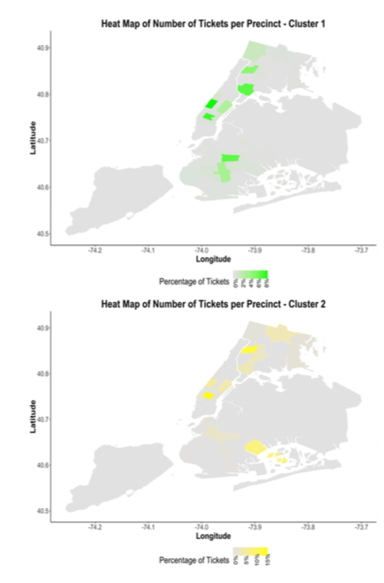

##  Distributed Data Analytics Framework for Cluster Analysis of Parking Violation
Co-authors: Evan Liu, Xi Yang, Nan Lin, Fiorella Tenorio

### Overview
In this [research paper](2019_SmartCity_ParkingViolation.pdf), we employed distributed systems to explore the similarities in parking ticket records using unsupervised machine learning techniques on a large dataset. Using 37 million ticket records (9 GB) collected by the New York City Department of Finance, we applied an algorithm to cluster existing tickets and dive deeper to find the distribution of precincts within different clusters. Amazon Web Services including S3, EC2 and EMR, and tools like MongoDB and Apache Spark were used in this endeavor. In this study, computational time and cost for different EMR settings were evaluated. We conclude that there are significant computational advantages to using distributed systems when implementing unsupervised learning on a large dataset as well as storing and managing data. We also observed that it is time efficient for a cluster with more workers instead of fewer workers with large memory space for the utilized data set. However we observed a trade-off between the execution time and the total cost for the cluster configuration.

Index Terms—
Distributed computing, Distributed databases Distributed information systems, Machine learning, Transporta- tion

### Workflow 

We built a pipeline that is scalable for store and process violation data which could be potentially high frequency and high volumn. We selected AWS as the primary platform to host storage, data extraction, transform and load(ETL) processes and machine learning tasks. The overview of data pipeline:

### Results

Beside comparing speed, performance and cost for different EMR clusters, we also visualized one cluster of results in heatmap. 

